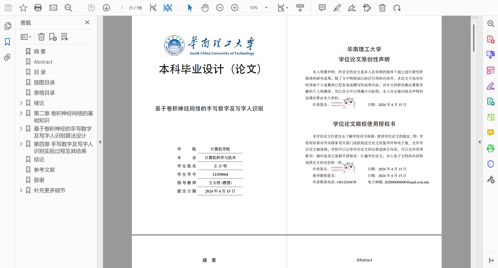
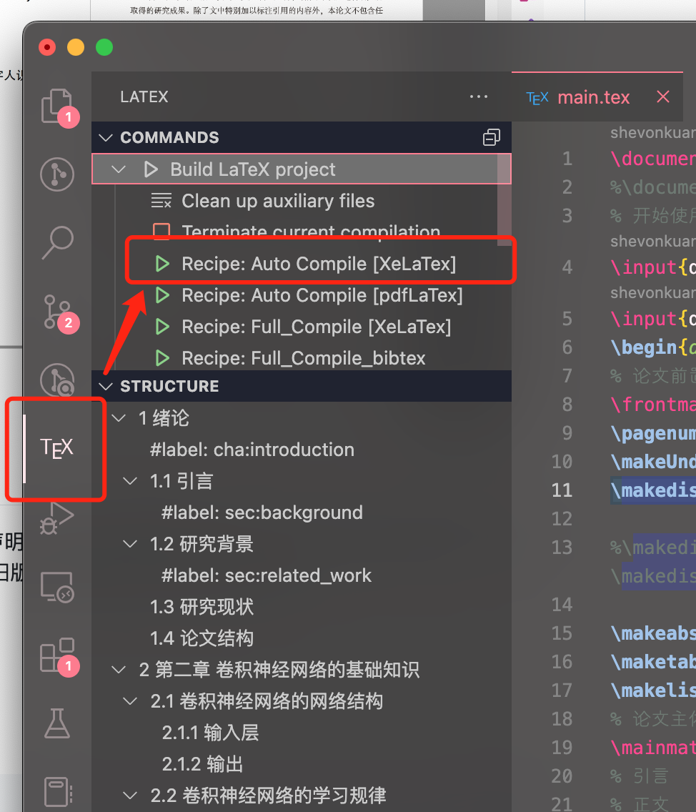

# 华南理工大学本科生 $\LaTeX$ 毕业论文模板

## 望周知：因为学校模板要求模凌两可，各位老师可能有自己心目中优秀论文该有的样子，所以本模板不一定适合所有友友们使用，也有很多友友用了这个模板导致被老师说很多格式上的问题，为此，本模板从现在起将不再维护，并且latex在根本上和word有很大差异，排版逻辑的不同，会导致在同一个规范下，和学校的word范例有所区别，比如1.5倍行距的问题，word如果定义了网格，并且勾选了跟随网格定义，那么这时候1.5倍行距是无效的，然而学校word模板很多地方都是这种操作，导致本模板会有不少地方行距（保证是1.5倍行距）和word范例（因为定义了网格，1.5倍行距不生效）不一样。因此本模板制作为latex学习参考。感谢支持。

## 介绍

本项目借用中山大学[Lovely-XPP/SYSU-thesis](https://github.com/Lovely-XPP/SYSU-thesis) 模板定义，重新构建了`scutthesis.cls`模板文件。这应该是最完善也是最容易使用的华工本科生论文模板了。

(注：由于`newtext`宏包的原因，不支持 Github Action 在线编译)

具体效果点[这里](./main.pdf)



## 目录

1. [华南理工大学本科生 $\\LaTeX$ 毕业论文模板](#华南理工大学本科生-latex-毕业论文模板)
   1. [介绍](#介绍)
   2. [目录](#目录)
   3. [❗❗❗ 近期重要更新 (2024.4.15 修订)](#-近期重要更新-2024415-修订)
      1. [更新方法](#更新方法)
   4. [新增 ppt 模板 (2023.6.1 修订)](#新增-ppt-模板-202361-修订)
   5. [修复页眉 bug (2023.5.31 修订)](#修复页眉-bug-2023531-修订)
   6. [如何编译](#如何编译)
      1. [`vscode`编译（强烈推荐）](#vscode编译强烈推荐)
      2. [texlive 编辑 (本地)](#texlive-编辑-本地)
   7. [TODO List](#todo-list)
   8. [相关规范](#相关规范)
      1. [毕业设计（论文）类型及基本要求](#毕业设计论文类型及基本要求)
      2. [毕业设计（论文）资料基本组成](#毕业设计论文资料基本组成)
         1. [各资料的具体要求](#各资料的具体要求)
            1. [任务书](#任务书)
            2. [毕业设计（论文）](#毕业设计论文)
            3. [图纸](#图纸)
            4. [电子文档](#电子文档)
            5. [开题报告（文献综述）](#开题报告文献综述)
            6. [外文翻译表及外文原件](#外文翻译表及外文原件)
      3. [毕业设计（论文）格式要求](#毕业设计论文格式要求)
            1. [封面论文标题](#封面论文标题)
            2. [摘要和关键词](#摘要和关键词)
            3. [目录](#目录-1)
            4. [正文](#正文)
      4. [毕业设计（论文）完成后的打印](#毕业设计论文完成后的打印)
   9. [❤ 致谢](#-致谢)
   10. [🤖 错误反馈以及改进](#-错误反馈以及改进)
   11. [🎯 声明](#-声明)
   12. [⭐ 如何使用 ⭐](#-如何使用-)
       1. [`main.tex`](#maintex)
       2. [字体字号等格式设置](#字体字号等格式设置)
          1. [字号设置](#字号设置)
          2. [字体设置](#字体设置)
       3. [表格](#表格)
       4. [图片](#图片)
          1. [导入图片](#导入图片)
          2. [图片并列](#图片并列)
       5. [交叉引用和参考文献引用](#交叉引用和参考文献引用)
          1. [参考文献](#参考文献)
          2. [引用](#引用)
       6. [代码和代码片段](#代码和代码片段)
          1. [行内代码](#行内代码)
          2. [导入代码文件并显示](#导入代码文件并显示)
          3. [代码片段环境（不推荐使用）](#代码片段环境不推荐使用)
          4. [示例](#示例)

## ❗❗❗ 近期重要更新 (2024.4.15 修订)

1. 23.10.10 规范中学校教务处模板中添加了学位论文原创性声明和论文版权使用授权书，同时更改了封面的布局版式，感谢[](https://github.com/ShevonKuan/SCUT-thesis/issues/1)的提醒，本模板已经更新，使用时请注意。若正在使用旧版本模板请参阅下面的更新方法。
2. 根据[#2](https://github.com/ShevonKuan/SCUT-thesis/issues/2)

### 更新方法

1. 点击[这里](https://github.com/ShevonKuan/SCUT-thesis/blob/main/scutthesis.cls)下载最新的`scutthesis.cls`文件，或使用`make update`直接更新`scutthesis.cls`。
2. 将下载的`scutthesis.cls`文件替换掉原来的文件
3. 在正文区添加`\makedisclaim`命令，如下
    ```diff
    \begin{document}
    % 论文前置部分
    \frontmatter
    \pagenumbering{Roman}
    \makeUndergraduateCover    % 生成封面
    +\makedisclaim           % 生成学位论文原创性声明
    \makeabstract       % 生成中英文摘要
    \maketableofcontents        % 生成目录
    \makelistoffiguretable % 生成图表目录
    % 论文主体部分
    \mainmatter
    ```
4. 可以使用`\makedisclaim[签名.png]`来指定签名图片，如果需要设置图片的位置详见`scutthesis.cls`文件中 384 行
    ```latex
    \begin{textblock}{5}(3.8,6.1) % 指定图片的位置和大小
        \includegraphics[height=2cm]{#1}
    \end{textblock}
    ```
5. 由于版权使用授权书需要手机号码和邮箱，请在`docs/info.tex`中加上这两行，不是的话可能编译失败
    ```diff
    \cmajor{计算机科学与技术}
    \emajor{Computer Science and Technology}
    +\phonenum{13612345678}
    +\mailbox{202000000000@mail.scut.edu}
    % 指导老师
    \cmentor{王大明 \ (教授)}
    ```

## 新增 ppt 模板 (2023.6.1 修订)

见[这里](https://github.com/ShevonKuan/SCUT-thesis/tree/main/SCUTbeamer)，相对于论文模板，需要更多的 latex 相关知识。


## 修复页眉 bug (2023.5.31 修订)

## 如何编译

### `vscode`编译（强烈推荐）

极力推荐使用`vscode`作为编辑器，真的不要再用`TexStudio`这种老古董了，`vscode`的插件生态非常好，而且有非常多的自定义功能（例如字数统计等），写 $\LaTeX$ 简直不要太爽。

1. 安装`vscode`，安装`LaTeX Workshop`插件，安装`LaTeX Utilities`插件；
2. 在`settings.json`配置文件（按住`ctrl+shift+p`或者`⌘+shift+p`打开命令列表，输入`json`选择`Preferences: Open User Settings (JSON)`），中添加以下配置
    ```json
    {
        "latex-workshop.latex.tools": [
            {
                // 编译工具和命令
                "name": "xelatex",
                "command": "xelatex",
                "args": [
                    "-synctex=1",
                    "-interaction=nonstopmode",
                    "-file-line-error",
                    "-shell-escape",
                    "%DOCFILE%"
                ]
            },
            {
                "name": "latexmk",
                "command": "latexmk",
                "args": [
                    "-xelatex",
                    "-synctex=1",
                    "-interaction=nonstopmode",
                    "-file-line-error",
                    "-shell-escape",
                    "%DOCFILE%"
                ]
            },
            {
                "name": "latexmk_pdf",
                "command": "latexmk",
                "args": [
                    "-pdf",
                    "-synctex=1",
                    "-interaction=nonstopmode",
                    "-file-line-error",
                    "-shell-escape",
                    "%DOCFILE%"
                ]
            },
            {
                "name": "pdflatex",
                "command": "pdflatex",
                "args": [
                    "-synctex=1",
                    "-interaction=nonstopmode",
                    "-file-line-error",
                    "%DOCFILE%"
                ]
            },
            {
                "name": "bibtex",
                "command": "bibtex",
                "args": ["%DOCFILE%"]
            },
            {
                "name": "texindy",
                "command": "texindy",
                "args": ["%DOCFILE%.idx"]
            },
            {
                "name": "makeindex",
                "command": "makeindex",
                "args": [
                    "%DOCFILE%.nlo",
                    "-s",
                    "nomencl.ist",
                    "-o",
                    "%DOCFILE%.nls"
                ]
            }
        ],
        "latex-workshop.latex.recipes": [
            {
                "name": "Auto Compile [XeLaTex]",
                "tools": ["latexmk"]
            },
            {
                "name": "Auto Compile [pdfLaTex]",
                "tools": ["latexmk_pdf"]
            },
            {
                "name": "Full_Compile [XeLaTex]",
                "tools": [
                    "xelatex",
                    "makeindex",
                    "texindy",
                    "xelatex",
                    "xelatex"
                ]
            },
            {
                "name": "Full_Compile_bibtex",
                "tools": [
                    "xelatex",
                    "bibtex",
                    "makeindex",
                    "texindy",
                    "xelatex",
                    "xelatex"
                ]
            },
            {
                "name": "xelatex",
                "tools": ["xelatex"]
            },
            {
                "name": "pdflatex",
                "tools": ["pdflatex"]
            },
            {
                "name": "xe->bib->xe->xe",
                "tools": ["xelatex", "bibtex", "xelatex", "xelatex"]
            },
            {
                "name": "pdf->bib->pdf->pdf",
                "tools": ["pdflatex", "bibtex", "pdflatex", "pdflatex"]
            }
        ],
        "latex-workshop.latex.autoClean.run": "onFailed",
        "latex-workshop.latex.recipe.default": "lastUsed",
        "latex-workshop.showContextMenu": true,
        "latex-workshop.intellisense.package.enabled": true
    }
    ```
3. 在`vscode`中打开`main.tex`文件，按`ctrl+alt+b`或者`⌘+alt+b`选择`Auto Compile [XeLaTex]`即可编译。

### texlive 编辑 (本地)

本模板需要使用 `texlive(>=2020)` 进行编译，编译命令如下：

```shell
make pdf
```

即可生成 `main.pdf` 文件。

若不支持`makefile`可以使用命令

```shell
latexmk main.tex -shell-escape
```

编译需要 python 环境和`pygments`宏包用于代码高亮，若不需要代码环境请在`scutthesis.cls`文件中删除`minted`相关代码。

安装`texlive`后部分系统需要安装`perl`依赖

```shell
dnf install -y python3-pip perl fontconfig-devel perl-YAML-Tiny
pip3 install pygments
```

windows 用户可直接执行

```bat
pip install pygments
```

## TODO List

-   [ ] 进一步优化代码，可支持多种需求

希望大家踊跃提出自己的想法，提交 pr，一起完善该 $\LaTeX$ 模板， Make **SCUT** Great Again！

## 相关规范

### 毕业设计（论文）类型及基本要求

实验研究类：学生必须独立完成一项研究性的实验，取得足够的实验数据，实验要有探索性，而不是简单重复已有的工作。撰写一篇**15000 字数以上**的研究报告或论文。

### 毕业设计（论文）资料基本组成

需装入档案袋并提交给学院保存的毕业设计（论文）材料包括：

-   [ ] 任务书；
-   [ ] 毕业设计（论文）（包括封面、摘要与关键词（中文/英文）、目录、论文（说明书）正文、参考文献、附录（必要时）、致谢（必要时））
-   [ ] 图纸或代码（必要时）
-   [ ] 电子文档
-   [ ] 开题报告（文献综述）
-   [ ] 外文翻译表及外文原件
-   [ ] 中期考核表
-   [ ] 论文评阅书
-   [ ] 总评分及评语表。

#### 各资料的具体要求

##### 任务书

任务书是经教研组（系、研究所）负责人审核，由指导教师向学生下达进行毕业设计的正式教学文件，学生必须根据任务书规定的质和量要求按时完成。任务书内容应具体、明确，以利于学生掌握和教师检测。任务书应在毕业设计正式启动前下达，以保证学生有充分时间撰写开题报告。

##### 毕业设计（论文）

1. 论文题目
   论文题目应突出重点、简明扼要，能恰当概括论文主要内容，要有较强的科学性和前瞻性、可行性，必要时可增加副标题。
2. 摘要
   摘要是简明、确切地记述毕业设计（论文）工作重要内容的短文。其基本要素包括**研究的目的**、**方法**、**结果（结论）**和**论文的意义**等。应避免将摘要写成目录式的内容介绍。**论文摘要要求 400-600 字**。摘要页不需写出论文题目。英文摘要与中文摘要的内容应完全一致，在英文语法、用词上应正确无误。
3. 关键词
   关键词是能覆盖论文主要内容的词条。**关键词要求 3-5 个**，按**词条概念外延层次由左到右排列**。英文关键词与中文关键词的内容应完全一致，在英文语法、用词上应正确无误。
4. 目录
   目录按章、节、条序号和标题编写，一般为二级或三级，要求标题层次清晰，**包含摘要（中、英文）、正文各章节标题、结论、参考文献、附录、致谢等。**
5. 论文（说明书）正文
   论文（说明书）正文包括**绪论（引言）**、**论文主体**及**结论**。
6. **绪论（引言）应说明本论文选题的背景、目的和意义**；简述**国内外研究现状及存在的问题**；介绍本项研究工作的**研究设想**，主要**研究内容**和**研究方法**；应解决的**主要问题及应达到的要求**。
7. **论文主体**是毕业论文的主要部分。对研**究问题的论述**及**系统分析**，比较研究，**模型或方案设计**，**案例论证或实证分析**，**模型运行的结果分析或建议**，**改进措施**等
8. **结论**是对整个研究工作的总结，应写得精炼、准确、完整。在结论中应明确指出本研究的**创新性**、**应用前景**及其对**社会经济的影响**，可阐述本课题研究中**尚存在的问题**及进一步**开展研究的见解和建议**等。
9. 参考文献
   **主要参考文献要求 10 篇**以上，其中**外文文献 2 篇**以上（指导教师认定为特殊类型的论文，可以不列外文参考文献）。
10. 注释
    论文中有个别名称或情况需要解释时，可加注说明，**注释可用页末注**（将注文放在加注页稿纸的下端）或**篇末注**（将全部注文几种在文章末尾），而不可用行中注（即注文夹在正文中）。
11. 附录
    对于某些不宜放在正文中的重要支撑材料，可编入附录，例如**有关的图表**、**计算机程序**、运行结果、**主要设备**、**仪器仪表的性能指标和测试精度**等。
12. 致谢
    致谢应以简短的文字对课题研究和论文（设计）撰写过程中曾直接给予帮助的人员（例如指导教师、答疑教师及其他人员）表示自己的谢意，这不仅是一种礼貌，也是对他人劳动的尊重，是治学者应有的思想作风。

##### 图纸

毕业设计中工程图纸的具体要求由教研组（系、研究所）所规定，绘图要求应符合各学科、各专业所对应的国家制图标准。工程图可由计算机或手工绘制。图纸数量较多时可单独装订成册。

##### 电子文档

毕业设计（论文）材料中所有文件资料，**均应完整有序地刻入光盘**，以供存档。

##### 开题报告（文献综述）

开题报告是保证毕业论文质量的一个重要环节，学生在教师指导下，**通过调研和查阅文献（需要 10 篇以上相关文章的阅读量）**，在指导教师指导下完成。开题报告需经过各系或论文指导小组讨论、学院教学指导委员会审查合格后，方可正式进入下一步毕业设计（论文）阶段。
**开题报告撰写不少于 2500 字**，内容包括工作任务分析、调研报告、方案拟定与分析、论文框架结构、实施计划、文献综述等。

##### 外文翻译表及外文原件

学生必须**阅读 5 篇（或 5 万印刷符）以上的外文参考资料**。提交**5000 汉字（或 2 万印刷符）以上的外文翻译**。翻译外文内容必须与毕业设计（论文）有紧密联系，并说明出处。原文如系网上下载，无法提供原文复印件时，则应注明下载的网址、网站、题名、文献发表时间等。

### 毕业设计（论文）格式要求

##### 封面论文标题

论文封面均使用中文撰写。二号，黑体，加粗，居中。

##### 摘要和关键词

摘要、关键词使用中文和所学专业相应的语言对照撰写。
中文摘要标题：小二号黑体，居中，单倍行距；
中文摘要内容：小四号，宋体，1.5 倍行距，段首行空两个汉字；
中文关键词标题：小四号黑体居左；
中文关键词内容：小四号，宋体。关键词之间用分号隔开，最后一个关键词不打标点符号。
英文摘要、关键词标题及内容：字号与中文摘要相同，字体为 Times New Roman。

##### 目录

目录中的标题应与正文中的标题一致，标明的页码应与论文文本的页码相对应。
目录标题：小二号黑体，居中，单倍行距。
目录中各章题序及标题：四号黑体，居左，1.5 倍行距；
各次级标题及题序：小四号，宋体，居左，1.5 倍行距。

##### 正文

1. 各级标题及正文
   采用三级标题排序，不得使用标点符号，各级标题均单独占一行书写，各层次题序及标题不得置于页面的最后一行（孤行）。
   工科、理科类专业的论文，章节编号一般采用三级标题的层次，按章（如“第一章”）、节（如“1.1”）、条（如“1.1.1”）的格式编写，各章题序的阿拉伯数字用 Times New Roman 体。
   第一级：用“第一章”、“第二章”、“第三章”等表示；小二号黑体，居中，单倍行距；
   第二级：用“1.1”、“1.2”、“1.3”等表示；小三号，黑体，居左，单倍行距；
   第三级：用“1.1.1”、“1.1.2”、“1.1.3”等表示；四号，黑体，居左，单倍行距；
   正文：小四号，宋体，1.5 倍行距。段首行缩进 2 个汉字。
   英文单词：字号、行距与正文相同，字体为 Times New Roman。
2. 插图和插表
   （1） 插图（表）应有图（表）题（由序号和标题组成），图（表）号按章编序，如第一章第一图的号为“图 1-1”。图题置于图下方，表题置于表上方。
   （2） 插图与其图题不得拆开排写于两页。图中若有分图时，分图号用“a)”、“b)”等置于分图之下。有数字标注的坐标图，必须注明坐标单位。
   （3） 表格不加左、右列线；表内数字空缺的格内加“—”字线；如某个表格需要换页接排，在随后的各页上应重复表的编排，编号后跟标题和（续）。如：表 2-1 加入激素后的实验结果比较（续）。
   （4） 插图（表）的标题和文字：五号，宋体。
3. 参考文献
   （1） 字号、字体与行距
   参考文献标题用小二号黑体，居中，单倍行距；
   参考文献和注释正文为小四号，宋体，1.5 倍行距。
   正文中应按顺序在引用参考文献处的文字右上角用[]标明，[]中序号应与参考文献中序号一致。
   （2） 中文参考文献书写格式
   专著：[序号] 作者名. 书名[M]. 出版地：出版单位，出版年：引文页码.
   期刊：[序号] 作者名. 题名[J]. 刊名，年，卷号(期号)：所引用的文献在期刊中的起止页码.
   报纸：[序号] 作者名. 题名[N]. 报刊名，年－月－日(版次) .
   论文集：析出文献主要责任者.析出文献题名［A］.原文献主要责任者（可选）.原文献题名［C］.出版地：出版者，出版年.起止页码.
   专利：［序号］专利所有者．专利题名[P]．专利国别：专利号,发布日期.
   技术标准：[序号］标准代号,标准名称[S]．出版地：出版者,出版年.
   报告：［序号］作者．文献题名[R]．报告地：报告会主办单位,年份.
   电子文献：［序号］作者．电子文献题名[文献类型/载体类型]．文献网址或出处,发表或更新日期/引用日期(任选).
   学位论文：[序号] 作者名. 题名[D]. 授予单位所在地：授予单位，授予年.
   （3） 外文参考文献书写格式按语言所在国学术界通行的格式。
   （4） 参考文献作者三名以内的全部列出，四名以上的列前三名，中文后加“等”,英文后加“et al”。
4. 附录
   附录标题用小二号黑体，居中，单倍行距；
   附录文献正文为小四号宋体。
5. 名词术语和字母
   论文名词术语必须前后统一。
   采用英语缩写词时，除本行业广泛应用的通用缩写词外，文中第一次出现的缩写词应用括号注明英文全文。
   文中代表变量的英文字母必须用斜体，其它用正体。微分号 d、圆周率 π、自然底数 e、矩阵转置 T 均应为正体。
6. 数字
   文中除习惯上用中文数字表示的以外，一般均采用阿拉伯数字，年份一概写全数，如“2015 年”不可以写成“15 年”。
7. 页眉页脚
   页眉标注从论文主体部分（绪论、正文、结论）开始。页眉分奇、偶页标注，其中偶数页的页眉为“华南理工大学学士学位论文”；奇数页的页眉为章序及章标题，例如： “第三章 城市道路的景观设计研究”。页眉的上边距为 15mm，在版心上边线加一行 1.0 磅粗的实线，其上居中打印页眉；页脚的下边距为 15mm。
8. 页码
   论文页码从主体部分（绪论、正文、结论）开始，直至“参考文献、附录、致谢”结束，用五号阿拉伯数字编连续码，页码位于页脚居中。摘要、目录、图表清单、主要符号表用五号罗马数字编连续码，页码位于页脚居中。封面不编入页码。

### 毕业设计（论文）完成后的打印

毕业设计（论文）由学生本人编排并打印在标准 A4 纸上；论文封面（底）、摘要和目录实行单面打印；论文主体部分（引言、正文、结论、参考文献、附录）实行双面打印。
封面学校标题用蓝色打印。论文封面纸推荐用 210g/m2 的橙色色书。所有页面的上下左右页面边距为 25mm。
毕业设计（论文）任务书、中期评价表、论文审阅表、论文评阅表、总评分及评语表在毕业设计（论文）管理系统下载打印。
毕业设计（论文）开题报告、外文翻译表、论文格式范例在毕业设计管理系统主页下载使用。

## ❤ 致谢

1. 十分感谢[@Lovely-XPP](https://github.com/Lovely-XPP)完善的[非官方的中山大学本科论文 LaTex 模板](https://github.com/Lovely-XPP/SYSU-thesis)

## 🤖 错误反馈以及改进

1. 同学们如果在编译或者使用过程中遇到了一些问题，请参照[这里](https://github.com/ryanhanwu/How-To-Ask-Questions-The-Smart-Way)的步骤尝试解决问题。如果还是没法解决，请开一个新 issue 汇报错误。
1. 如果您想参与项目的维护，我们强烈建议您发起访问请求(Access request)到本项目，即可成为本项目的开发人员! 我们**_非常欢迎校友的加入_**。
   或者，Fork 本仓库到您的 github 仓库中，修改完成后给本项目提交`Merge Request`。

## 🎯 声明

1. 您可以任意地使用和修改这个模板，但该模板可能无法满足最新的《附件 1：本科毕业设计（论文）撰写规范（工科、理科类专业).doc》。
2. 目前项目组人手紧缺，**强烈欢迎校友们的加入**。

## ⭐ 如何使用 ⭐

下载该仓库，将会得到`附件2：本科毕业设计（论文）格式范例（工科、理科类专业).doc`该文件的$\LaTeX$版本，可以参考该文件内的定义使用

### `main.tex`

```tex
\documentclass{scutthesis} % 不填充空白页。如果需要双面打印版，请注释掉本行并启用下一行
%\documentclass[print-both-sides]{scutthesis} % 使用双面打印版（填充额外空白页以保证每一章开头都在奇数页）
% 开始使用该模板请修改以下文件
\input{docs/info}     % 在这里填写论文相关信息
\input{docs/abstract}     % 在这里填写摘要内容注意华工要求关键词用分号分隔
\begin{document}
% 论文前置部分
\frontmatter
\pagenumbering{Roman}
\makeUndergraduateCover    % 生成封面
\makedisclaim
%\makedisclaim[title.png]            % 生成学位论文原创性声明
% 将title.png替换为自己的签名文件，如果不需要签名的话，可以直接使用\makedisclaim命令
\makeabstract       % 生成中英文摘要
\maketableofcontents        % 生成目录
\makelistoffiguretable % 生成图表目录
% 论文主体部分
\mainmatter
% 引言
% 正文
\include{docs/chap01} % 使用include导入章节tex文件
\newclearpage
\include{docs/chap02}
\newclearpage
\include{docs/chap03}
\newclearpage
\include{docs/chap04}
\newclearpage
% 论文后置部分
\backmatter
\include{docs/conclusion} % 制作结论章节
\newclearpage
% 参考文献
\makereferences % 制作参考文献
% 致谢
\include{docs/ack} % 制作致谢
\newclearpage
% 附录部分
% 附录
{
    \appendix
    \include{docs/appendix1} % 导入附录
    \newclearpage
}
\end{document}
```

### 字体字号等格式设置

#### 字号设置

```tex
\zihao{#1}
```

`#1`参数为字号，例如`\zihao{2}`为二号，使用负数表示小号，如`zihao{-4}`为小四号。

#### 字体设置

```tex
\heiti % 使用黑体
\songti % 使用宋体
\textbf % 加粗字体（为满足学校规范，加粗均为使用描边伪粗体）
```

### 表格

```tex
\begin{table}[htbp]
    \centering
    \caption{ABCvsA数字识别实验结果}
    \label{tab:1}
    \begin{tabular}{@{}cccc@{}}
        \toprule
        训练样本 & ABC & 样本个数    & 3000    \\ \midrule
        测试样本 & A   & 样本个数    & 1000    \\
        训练次数 & —   & 单次训练样本数 & 10      \\
        学习率  & 1   & 正确率     & 99.50\% \\ \bottomrule
    \end{tabular}
\end{table}
```

表格均使用三线表，使用示例如上。

### 图片

#### 导入图片

```tex
\begin{figure}[htbp] % image examples
    \centering
    \includegraphics[height=6.54cm]{image/chap04/1.jpg}
    \caption{ABCvsA数字识别实验集}
    \label{fig:fig1}
\end{figure}
```

图片均需要将标题置于图片下方

#### 图片并列

使用`subfigure`环境画子图


```tex
\begin{figure}[htbp] % image examples & compare
    \begin{subfigure}{0.5\textwidth}
        \centering
        \includegraphics[height=6.54cm]{image/chap04/1.jpg}
        \caption{实验训练集}
        \label{fig:compare1}
    \end{subfigure}
    \begin{subfigure}{0.5\textwidth}
        \centering
        \includegraphics[height=6.54cm]{image/chap04/2.jpg}
        \caption{实验测试集}
        \label{fig:compare2}
    \end{subfigure}
    \caption{ABCvsA数字识别实验集}
    \label{fig:complex}
\end{figure}
```

### 交叉引用和参考文献引用

#### 参考文献

参考文献均使用 bibtex 的形式记录在`main.bib`文件中，当需要引用时可使用`\cite`和`\overcite\`两个命令引用，前者为引用符号处于文本基线，后者为上标形式。如图


对应代码

```tex
\section{研究现状}
笔迹获取的方式有两种，所以鉴别方式也分为离线鉴别和在线鉴别\overcite{ref2,ref3}。在线鉴别是采用专用的数字板来实时收集书写信号。由文献\cite{ref4,ref5,ref6,ref7}可知，因为信号是实时采集的，所以能采集的数据不仅包括笔迹序列，而且可以采集到书写时的加速度、压力、速度等丰富有用的动态信息。
```

#### 引用

已定义自动引用格式，所有引用图片、公式、表格等内容均使用同一个命令`\autoref{}`进行引用，该命令将会自动产生例如` 式``图 `等前置词语。


```tex
\subsection{前向传播}
如果用$l$来表示当前的网络层，那么当前网络层的输出如\autoref{eq:fp}所示：
\begin{equation}
    \label{eq:fp}
    {x^l} = f({u^l}),\text{其中}{u^l} = {W^l}{x^{l - 1}} + {b^l}
\end{equation}
```

### 代码和代码片段

#### 行内代码

```tex
\code{#1}{#2}
```

`#1`为高亮语言，`#2`为代码内容

#### 导入代码文件并显示

```tex
\inputcode{#1}{#2}
```

`#1`为高亮语言，`#2`为代码文件位置

#### 代码片段环境（不推荐使用）

```tex
\begin{codeblock}{#1}
<代码内容>
\end{codeblock}
```

`#1`为高亮语言

#### 示例


```tex
\begin{codeblock}{python}
#从图片检测公式部分
#输入：图片 输出：公式列表
import sys
sys.path.append("ocr")

import cv2
import copy
import numpy as np
import time
import logging
from PIL import Image
import tools.infer.utility as utility
import tools.infer.predict_rec as predict_rec
import tools.infer.predict_det as predict_det
import tools.infer.predict_cls as predict_cls
from ppocr.utils.utility import get_image_file_list, check_and_read_gif
from ppocr.utils.logging import get_logger
from tools.infer.utility import draw_ocr_box_txt, get_rotate_crop_image
import os
import subprocess
import predict_function

#通过args控制参数
args = utility.parse_args()
args.image_dir = "./img/test13.jpg"
formula = predict_function.detect_formula_from_img(args)
print("图片包含的公式为：")
print(formula)
\end{codeblock}
也可在行内插入代码片段，例如：Python中重载加法运算符的函数为\code{python}{__add__}，类的标识符为\code{python}{class}。
% 此外，还可直接插入代码文件，例如插入\texttt{./code/demo.cpp}的效果为：
\inputcode{cpp}{code/demo.cpp}
```
